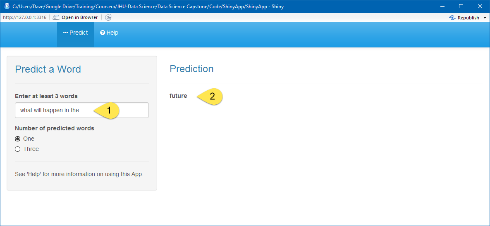
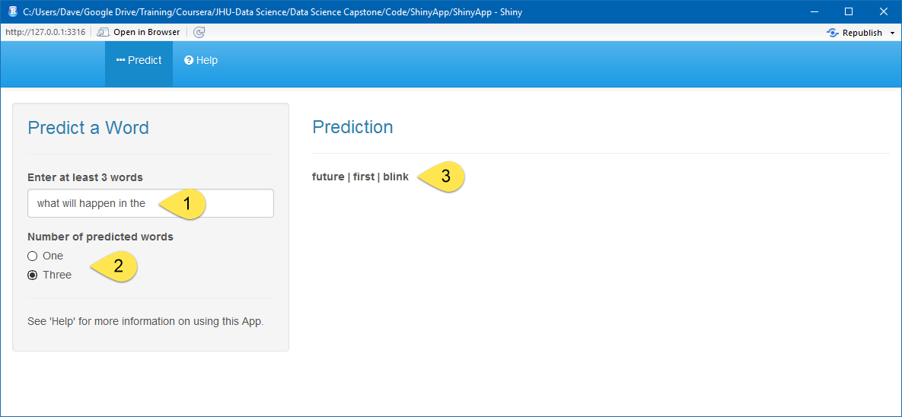
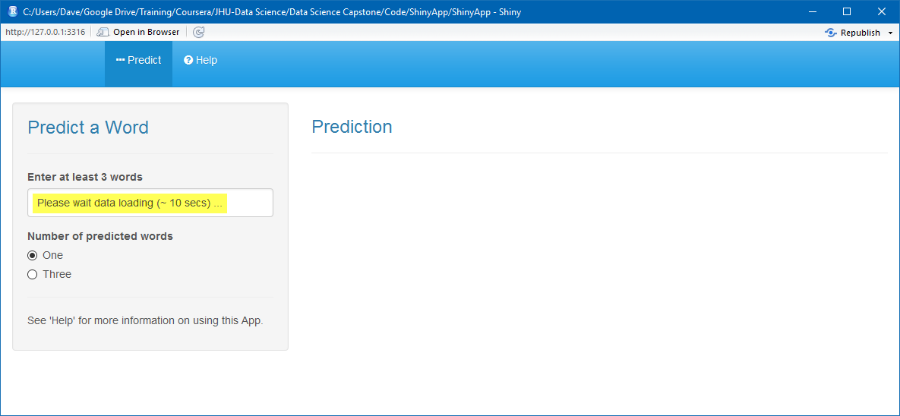
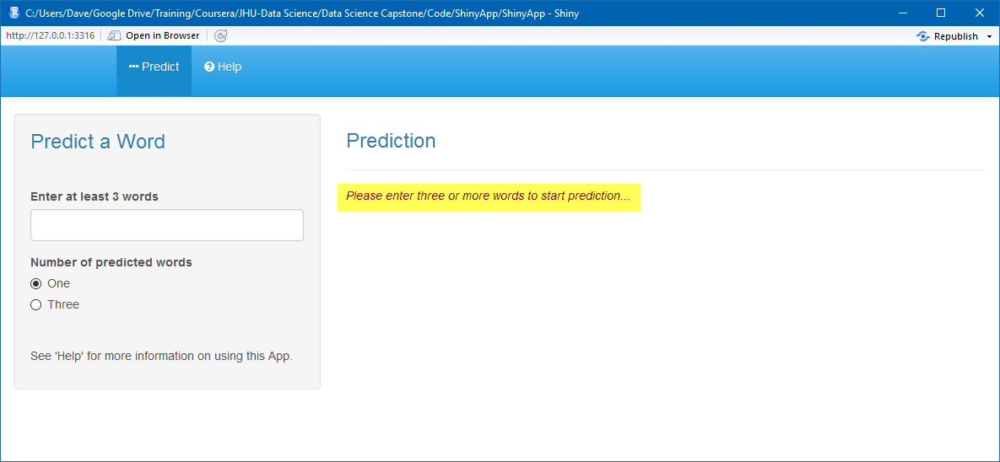

---

output: 
  html_document: 
    keep_md: yes
---

## Introduction

This Shiny App is part of the final project for the Coursera Datascience Capstone course from John Hopkins University.

This app will predict the next word after a user enters at least three words in the text box.

### How To Use This App

#### Predicting One Word

1. Enter the beginning of a sentance in the input box (1)

2. The next predicted word will appear in the output pane on the right side (2)

#### Predicting Three Words

1. Enter the beginning of a sentance in the input box (1)

2. Select **"Three"** for "Number of predicted words" (2)

3. Up to three words with the highest predicted probabilities will appear in the output pane on the right side (3). **Note:** If less than 3 words can be predicted, then only the available predicted words will be shown.  

### Important Notes

A. It may take about 10 seconds for the data files to load. While file loading is taking place, a message *"Please wait for data to load..."* will be displayed in the input box.

B. You must enter at least three words for a prediction to be made. If less than three words are entered, then an error message will be displayed

