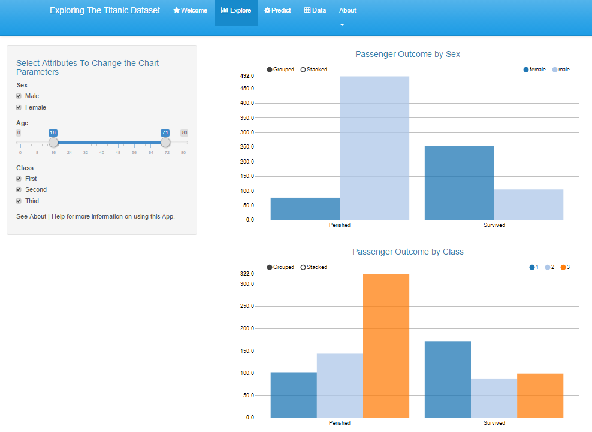

<style>
.small-code pre code {
  font-size: 1em;
}
</style>

Exploring The Titanic
========================================================
author: Coursera Developing Data Products Project
date: December 22nd, 2015

Introduction
========================================================

The RMS Titanic was a passanger ship that, in 1912, sank in the Atlantic Ocean shortly after it hit an iceberg. 

This Shiny App explores some of the data from the passengers on the ship and attempts to predict whether someone would survive or not based on various attributes.

You can access the Shiny App at https://dvd940.shinyapps.io/TitanicShinyApp


Exploration 
========================================================
On the **Explore** tab, you can visualize the data

<div align="left">

</div>

Prediction
========================================================
class: small-code

The Shiny App can also make predictions based on inputs the user makes. Here is an exmaple using dummy (static) inputs: 


```r
library(caret)
model <- readRDS("titanic.model.rds")

## Test Data
pClass <- "First"; sx <- "female"; Ag <- 24;
dep <- "S"; Tle <- "Mrs"; Fam <- "Yes";
my.test.data <- data.frame(Class = factor(pClass), Sex = factor(sx), Age = Ag, 
                Embarked = factor(dep), Title = factor(Tle), Family = factor(Fam))
prediction <- predict(model, my.test.data, "prob")
cat("The probability of survival is ", round(prediction[,2] * 100, digits = 2), "%")
```

```
The probability of survival is  92.8 %
```

More Information
========================================================

To access this Shiny App and explore the data for yourself, visit https://dvd940.shinyapps.io/TitanicShinyApp

To view the prediction model or see the code for the Shiny App, you can visit the Github repository at https://github.com/dvd940/Developing.Data.Products
