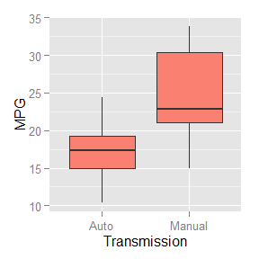
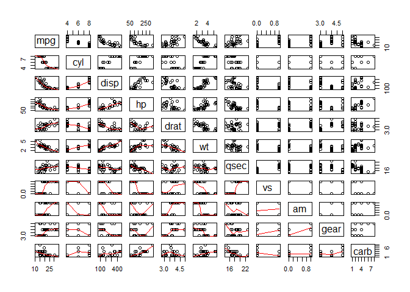
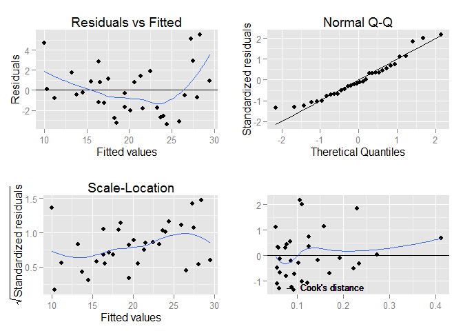

# Coursera Regression Project


# Executive Summary

This report is based on data from automobile industry magazine Motor Trend. The report examines a data set of a collection of cars to explore the relationship between a set of variables and miles per gallon (MPG). The report specifically aims to answer whether automatic transmission is better for MPG compared to manual and to quantify that difference.

**Note:** This report was written as an R Markdown file and converted to PDF using **knitr version 1.11**.

### Exploratory Data Analysis

```r
library(datasets); library(dplyr)  # load libraries
data("mtcars")  # load in the mtcars dataset (part of )
auto <- filter(mtcars, am == 0); mean.mpg.auto <- mean(auto$mpg)  # mean: auto cars
manual <- filter(mtcars, am == 1); mean.mpg.man <- mean(manual$mpg)  # mean: manual cars
```
The mean MPG for automatic transmission cars is found to be **17.15** whereas the mean MPG for manual transmission cars is **24.39**. So it would appear that manual transmission cars are better for MPG. See **Figure 1** in the Appendix for a box plot illustrating these results.

Next a matrix of scatter plots and correlations is done on all the variables in the data set to determine if there are other confounding variables that could explain the initial results. See See **Figure 2** in the Appendix for the scatter plot matrix.


```r
mt.cor = cor(mtcars)
set.caption("Corrolation Table")
panderOptions("table.split.table", 130); panderOptions("digits", 3)
pander(mt.cor[1,])
```


------------------------------------------------------------------------
 mpg   cyl    disp    hp    drat    wt    qsec   vs    am   gear   carb 
----- ------ ------ ------ ------ ------ ------ ----- ---- ------ ------
  1   -0.852 -0.848 -0.776 0.681  -0.868 0.419  0.664 0.6   0.48  -0.551
------------------------------------------------------------------------

Table: Corrolation Table

The correlation results indicate that mpg is correlated with cyl, disp, hp and wt. Since displacement (disp) would be dependent on the number of cylinders (cyl), only disp, hp and wt will be used in the rest of the analysis. 

### Regression Analysis

First a linear regression is conducted to observe the direct relationship between mpg and transmission.


```r
fit <- lm(mpg ~ am, data = mtcars)
fit$coefficients
```

```
## (Intercept)          am 
##   17.147368    7.244939
```
See **Figure 3 ** in the appendix for the full output from the lm command.

From this regression, the intercept of 17.147 is the average MPG for an automatic car (we saw this earlier) and the coefficient indicates that a manual car has an increase of 7.245 MPG. However, the R^2^ value of 0.36 is the percentage of variation explained by the regression model which is not very high.

Next a nested model test is done with the added terms wt, hp and disp.


```r
fit2 <- lm(mpg ~ am + wt, data = mtcars)  # am + wt
fit3 <- lm(mpg ~ am + wt + hp, data = mtcars)  # am + wt + hp
fit4 <- lm(mpg ~ am + wt + hp + disp, data = mtcars)  # am + wt + hp + disp
anv <- anova(fit, fit2, fit3, fit4)
```
See **Figure 4 ** in the appendix for the full output from the anova command.

The p-values from the nested model test indicate that the added model fit3 terms are significant over model fit2 and the model fit2 terms are significant over the original model. However, the added term (disp) in model fit4 is not significant in our tests.


```r
fit3$coefficients
```

```
## (Intercept)          am          wt          hp 
## 34.00287512  2.08371013 -2.87857541 -0.03747873
```

```r
summary(fit3)$r.squared
```

```
## [1] 0.8398903
```

Summarizing the coefficients of model fit3 shows that when wt and hp are included in the model, manual transmission cars have an mpg increase of **2.084**. Also, this time the R^2^ value of 0.84.

### Residuals

Lastly, the residuals should exhibit no trends and be normally distributed. The residuals vs. fitted values plot and the Normal Q-Q plot indicate that the residuals do not show a pattern and that they are close to being normally distributed. (See **Figure 5** in the appendix.)

# Conclusion

***Is an automatic or manual transmission better for MPG?***

It appears that manual transmission cars are better for MPG compared to automatic cars. However when modeled with confounding variables like displacement, HP and weight, the difference is not as significant. 

 ***Quantify the MPG difference between automatic and manual transmissions***

Analysis shows that when only transmission was used in the model manual cars have an mpg increase of **7.245**. However, when variables wt and hp are included, the manual car advantage drops to **2.084** with other variables contributing to the effect.


\pagebreak

# Appendix

### Figure 1: Boxplot of MPG as a function of transmission

 

### Figure 2: Cars Scatterplot Matrix

 

### Figure 3: Output from linear model mpg ~ am


```
## 
## Call:
## lm(formula = mpg ~ am, data = mtcars)
## 
## Residuals:
##     Min      1Q  Median      3Q     Max 
## -9.3923 -3.0923 -0.2974  3.2439  9.5077 
## 
## Coefficients:
##             Estimate Std. Error t value Pr(>|t|)    
## (Intercept)   17.147      1.125  15.247 1.13e-15 ***
## am             7.245      1.764   4.106 0.000285 ***
## ---
## Signif. codes:  0 '***' 0.001 '**' 0.01 '*' 0.05 '.' 0.1 ' ' 1
## 
## Residual standard error: 4.902 on 30 degrees of freedom
## Multiple R-squared:  0.3598,	Adjusted R-squared:  0.3385 
## F-statistic: 16.86 on 1 and 30 DF,  p-value: 0.000285
```


### Figure 4: Output from nested models


```
## Analysis of Variance Table
## 
## Model 1: mpg ~ am
## Model 2: mpg ~ am + wt
## Model 3: mpg ~ am + wt + hp
## Model 4: mpg ~ am + wt + hp + disp
##   Res.Df    RSS Df Sum of Sq       F    Pr(>F)    
## 1     30 720.90                                   
## 2     29 278.32  1    442.58 66.4206 9.394e-09 ***
## 3     28 180.29  1     98.03 14.7118 0.0006826 ***
## 4     27 179.91  1      0.38  0.0576 0.8122229    
## ---
## Signif. codes:  0 '***' 0.001 '**' 0.01 '*' 0.05 '.' 0.1 ' ' 1
```


### Figure 5: Residuals plot 


```
## geom_smooth: method="auto" and size of largest group is <1000, so using loess. Use 'method = x' to change the smoothing method.
## geom_smooth: method="auto" and size of largest group is <1000, so using loess. Use 'method = x' to change the smoothing method.
## geom_smooth: method="auto" and size of largest group is <1000, so using loess. Use 'method = x' to change the smoothing method.
```

 
