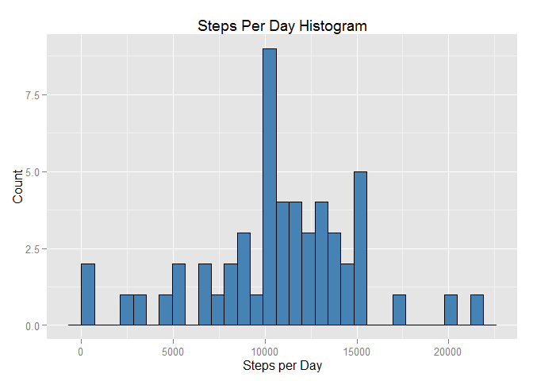
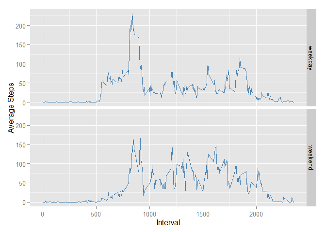

# Reproducible Research: Peer Assessment 1


```
## Warning: package 'dplyr' was built under R version 3.1.3
```

```
## Warning: package 'ggplot2' was built under R version 3.2.0
```


## Loading and preprocessing the data

**Requirement:** *1. Show any code that is needed to Load the data*

This scripts assumes that the file `activity.zip` is located in the same working directory.


```r
# Read in the data from the zipped file.
activity.csv <- unz("activity.zip", "activity.csv")
activity.data <- read.csv(activity.csv)
head(activity.data, 15)
```

```
##    steps       date interval
## 1     NA 2012-10-01        0
## 2     NA 2012-10-01        5
## 3     NA 2012-10-01       10
## 4     NA 2012-10-01       15
## 5     NA 2012-10-01       20
## 6     NA 2012-10-01       25
## 7     NA 2012-10-01       30
## 8     NA 2012-10-01       35
## 9     NA 2012-10-01       40
## 10    NA 2012-10-01       45
## 11    NA 2012-10-01       50
## 12    NA 2012-10-01       55
## 13    NA 2012-10-01      100
## 14    NA 2012-10-01      105
## 15    NA 2012-10-01      110
```


**Requirement:** *2. Process/transform the data (if necessary) into a format suitable for your analysis*

For the first part of the assignment, missing values in the dataset can be ignored. This can be achieved using the `complete.cases()` function to remove the NA values.


```r
activity.data.clean <- activity.data[complete.cases(activity.data), ]
head(activity.data.clean, 15)
```

```
##     steps       date interval
## 289     0 2012-10-02        0
## 290     0 2012-10-02        5
## 291     0 2012-10-02       10
## 292     0 2012-10-02       15
## 293     0 2012-10-02       20
## 294     0 2012-10-02       25
## 295     0 2012-10-02       30
## 296     0 2012-10-02       35
## 297     0 2012-10-02       40
## 298     0 2012-10-02       45
## 299     0 2012-10-02       50
## 300     0 2012-10-02       55
## 301     0 2012-10-02      100
## 302     0 2012-10-02      105
## 303     0 2012-10-02      110
```


## What is mean total number of steps taken per day?


**Requirement:** *1. Calculate the total number of steps taken per day*

This is achieved by aggregating the data by day using the dplyr package `group_by()` & `summarise()` functions. 


```r
library(dplyr)
total.steps.per.day <- activity.data.clean %>% group_by(date) %>% summarise(total = sum(steps))
```

This results in a dataframe which aggregates the number of steps per day.


```r
head(total.steps.per.day, 15)
```

```
## Source: local data frame [15 x 2]
## 
##          date total
## 1  2012-10-02   126
## 2  2012-10-03 11352
## 3  2012-10-04 12116
## 4  2012-10-05 13294
## 5  2012-10-06 15420
## 6  2012-10-07 11015
## 7  2012-10-09 12811
## 8  2012-10-10  9900
## 9  2012-10-11 10304
## 10 2012-10-12 17382
## 11 2012-10-13 12426
## 12 2012-10-14 15098
## 13 2012-10-15 10139
## 14 2012-10-16 15084
## 15 2012-10-17 13452
```


**Requirement:** *2. Make a histogram of the total number of steps taken each day*

A histogram is plotted using ggplot with the total.steps.per.day data frame.


```r
library(ggplot2)
plot <- ggplot(data=total.steps.per.day, aes(x=total))
plot <- plot + geom_histogram(colour="black", fill="steelblue", binwidth = 706)
plot <- plot + ggtitle("Steps Per Day Histogram")
plot <- plot + ylab("Count") + xlab("Steps per Day")
plot
```

 

**Requirement:** *3. Calculate and report the mean and median of the total number of steps taken per day*


```r
# Calculate and report the mean and median total number of steps taken per day
mean.steps <- mean(total.steps.per.day$total)
mean.steps
```

```
## [1] 10766.19
```

```r
median.steps <- median(total.steps.per.day$total)
median.steps
```

```
## [1] 10765
```

Mean is 10766.19. Median is 10765

## What is the average daily activity pattern?

**Requirement:** *1. Make a time series plot (i.e. type = "l") of the 5-minute interval (x-axis) and the average number of steps taken, averaged across all days (y-axis).*

This is done by using dplyr to group by interval and then summarizing by the mean of the steps.


```r
five.min.interval.average <- activity.data.clean %>% group_by(interval) %>% summarise(average = mean(steps))

plot <- ggplot(five.min.interval.average, aes(interval, average)) 
plot <- plot + geom_line(color = "steelblue")
plot <- plot + ggtitle("Average Number of Steps Taken for Each Interval")
plot <- plot + ylab("Average Steps Per day") + xlab("Interval")
plot
```

 

**Requirement:**  *2. Which 5-minute interval, on average across all the days in the dataset, contains the maximum number of steps?*

This can be calculated by using the `which.max()` function.


```r
max.interval <- which.max(five.min.interval.average$average)
max.interval
```

```
## [1] 104
```

```r
max.interval.label <- five.min.interval.average$interval[max.interval]
max.interval.label
```

```
## [1] 835
```

The interval with the maximum number of steps is the 104<sup>th</sup> interval which is labelled 835 in the original dataset.


## Imputing missing values

**Requirement:**  *1. Calculate and report the total number of missing values in the dataset (i.e. the total number of rows with NAs)*


```r
num.of.na <- sum(is.na(activity.data$steps))
num.of.na
```

```
## [1] 2304
```

There are 2304 NA items in the original data set.

**Requirement:** *2. Devise a strategy for filling in all of the missing values in the dataset. The strategy does not need to be sophisticated. For example, you could use the mean/median for that day, or the mean for that 5-minute interval, etc. Create a new dataset that is equal to the original dataset but with the missing data filled in.*

In the code the follows, the mean for the 5-minutes interval is used to impute NA values.

Earlier, the mean for each of the 5-minutes intervals was calculated

```r
head(five.min.interval.average, 15)
```

```
## Source: local data frame [15 x 2]
## 
##    interval   average
## 1         0 1.7169811
## 2         5 0.3396226
## 3        10 0.1320755
## 4        15 0.1509434
## 5        20 0.0754717
## 6        25 2.0943396
## 7        30 0.5283019
## 8        35 0.8679245
## 9        40 0.0000000
## 10       45 1.4716981
## 11       50 0.3018868
## 12       55 0.1320755
## 13      100 0.3207547
## 14      105 0.6792453
## 15      110 0.1509434
```

**Requirement:** *3. Create a new dataset that is equal to the original dataset but with the missing data filled in.*


```r
all.activity <- merge(activity.data, five.min.interval.average, by="interval")
na.values <- is.na(all.activity$steps)
all.activity$steps[na.values] <- all.activity$average[na.values]
imputed.activity <- select(all.activity, date, interval, steps)
head(imputed.activity, 15)
```

```
##          date interval    steps
## 1  2012-10-01        0 1.716981
## 2  2012-11-23        0 0.000000
## 3  2012-10-28        0 0.000000
## 4  2012-11-06        0 0.000000
## 5  2012-11-24        0 0.000000
## 6  2012-11-15        0 0.000000
## 7  2012-10-20        0 0.000000
## 8  2012-11-16        0 0.000000
## 9  2012-11-07        0 0.000000
## 10 2012-11-25        0 0.000000
## 11 2012-11-04        0 1.716981
## 12 2012-11-08        0 0.000000
## 13 2012-10-12        0 0.000000
## 14 2012-10-30        0 0.000000
## 15 2012-11-26        0 0.000000
```

**Requirement:** *4. Make a histogram of the total number of steps taken each day and Calculate and report the mean and median total number of steps taken per day. Do these values differ from the estimates from the first part of the assignment? What is the impact of imputing missing data on the estimates of the total daily number of steps?*


```r
new.total.steps.per.day <- all.activity %>% group_by(date) %>% summarise(total = sum(steps))
plot <- ggplot(data=new.total.steps.per.day, aes(x=total))
plot <- plot + geom_histogram(colour="black", fill="steelblue", binwidth = 706)
plot <- plot + ggtitle("Steps Per Day Histogram")
plot <- plot + ylab("Count") + xlab("Steps per Day")
plot
```

 


```r
mean.steps <- mean(new.total.steps.per.day$total)
mean.steps
```

```
## [1] 10766.19
```

```r
median.steps <- median(new.total.steps.per.day$total)
median.steps
```

```
## [1] 10766.19
```

Mean is 10766.19. Median is 10766.19

Previously, the mean was the same value (10766.19) as we get now whereas the median was slightly less at 10765.

The impact of imputing values using the mean for the 5-minutes intervals appears to have minimal impact. 


## Are there differences in activity patterns between weekdays and weekends?


**Requirement:** *1. Create a new factor variable in the dataset with two levels – “weekday” and “weekend” indicating whether a given date is a weekday or weekend day.*


```r
imputed.activity <- imputed.activity %>% mutate(day = weekdays(as.Date(date)))
imputed.activity$weekday.weekend <- sapply(imputed.activity$day, function(x) ifelse(grepl("Saturday|Sunday", x),"weekend","weekday"))
imputed.activity$weekday.weekend <- as.factor(imputed.activity$weekday.weekend)
```


```r
head(imputed.activity, 15)
```

```
##          date interval    steps       day weekday.weekend
## 1  2012-10-01        0 1.716981    Monday         weekday
## 2  2012-11-23        0 0.000000    Friday         weekday
## 3  2012-10-28        0 0.000000    Sunday         weekend
## 4  2012-11-06        0 0.000000   Tuesday         weekday
## 5  2012-11-24        0 0.000000  Saturday         weekend
## 6  2012-11-15        0 0.000000  Thursday         weekday
## 7  2012-10-20        0 0.000000  Saturday         weekend
## 8  2012-11-16        0 0.000000    Friday         weekday
## 9  2012-11-07        0 0.000000 Wednesday         weekday
## 10 2012-11-25        0 0.000000    Sunday         weekend
## 11 2012-11-04        0 1.716981    Sunday         weekend
## 12 2012-11-08        0 0.000000  Thursday         weekday
## 13 2012-10-12        0 0.000000    Friday         weekday
## 14 2012-10-30        0 0.000000   Tuesday         weekday
## 15 2012-11-26        0 0.000000    Monday         weekday
```

```r
str(imputed.activity$weekday.weekend)
```

```
##  Factor w/ 2 levels "weekday","weekend": 1 1 2 1 2 1 2 1 1 2 ...
```


**Requirement:** * 2. Make a panel plot containing a time series plot (i.e. type = "l") of the 5-minute interval (x-axis) and the average number of steps taken, averaged across all weekday days or weekend days (y-axis). See the README file in the GitHub repository to see an example of what this plot should look like using simulated data.*


```r
new.five.min.interval.average <- imputed.activity %>% group_by(weekday.weekend,interval) %>% summarise(average = mean(steps))

plot <- ggplot(new.five.min.interval.average, aes(x=interval, y=average))
plot <- plot + geom_line(color = "steelblue")
plot <- plot + facet_grid(weekday.weekend ~ .)
plot <- plot + ylab("Average Steps") + xlab("Interval")
plot
```

 

These two charts have similar shapes but the weekday chart shows slightly more activity in the morning whereas the weekend chart shows a slight increase in activity for the later intervals.  
