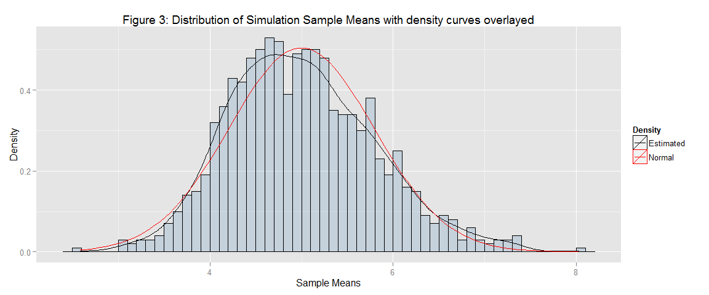
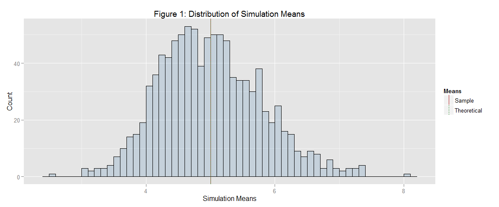

# Statistical Inference Project 1
August 9, 2015  


## Overview
In this project, the exponential distribution will be investigated and compared with the Central Limit Theorem using simulations written in R. For the purpose of this project, lambda $\lambda$ will be set to 0.2 and the distribution of 40 exponentials will be investigated. The project will be conducted using 1000 simulations.  

## Simulations
In the following simulation, 40 exponentials are calculated and averaged. The simulation is done 1000 times.  

```r
set.seed(8310) # For reproducibilty
lambda <- 0.2
number.of.simulations <- 1000
n <- 40  # distribution of 40 exponentials will be investigated.

simulation <- matrix(rexp(number.of.simulations * n, rate=lambda), 
                     number.of.simulations, n)
simulation.mean <- rowMeans(simulation)  # Get mean of each row (each simulation)
```

## Sample Mean versus Theoretical Mean
**Requirement 1**. *Show the sample mean and compare it to the theoretical mean of the distribution.*

The theoretical mean is given by the formula $1/\lambda$. Here the theoretical mean is calculated and compared with the sample mean that the simulation yielded. 


```r
theoretical.mean <- 1/lambda
theoretical.mean
```

```
## [1] 5
```

```r
sample.mean <- mean(simulation.mean)
sample.mean
```

```
## [1] 5.002704
```

The theoretical mean is 5 whereas the sample mean is centered at 5.0027045.

See **appendix 1** for a plot.

## Sample Variance versus Theoretical Variance
**Requirement 2**: *Show how variable the sample is (via variance) and compare it to the theoretical variance of the distribution.*

For the exponential distribution, the theoretical standard deviation $\sigma$ is given by the formula $1/\lambda$ so the expected value of the variance of distribution of means is given by the formula $\sigma^2/n$ or $(1/\lambda)^2/n$. 


```r
theoretical.variance <- (1/lambda)^2/n
theoretical.variance
```

```
## [1] 0.625
```

```r
sample.variance <- round(var(simulation.mean), 3)
sample.variance
```

```
## [1] 0.629
```

So in the simulations run for this report, the theoretical variance is 0.625 whereas the sample variance is 0.629.

## Distribution
**Requirement 3:** *Show that the distribution is approximately normal*

Because of the Central Limit Theorem, the means of samples should follow a normal distribution.

To determine the shape of the distribution, a density estimate curve of the data is drawn.


```r
simulation.mean.df <- data.frame(simulation.mean)  # convert to dataframe for plotting
plot <- ggplot(simulation.mean.df, aes(x = simulation.mean)) 
plot <- plot + geom_histogram(aes(y=..density..), color="black", 
                              fill = "steelblue", binwidth = 0.1, alpha = 0.2)
plot <- plot + geom_density(aes(color = "Estimated"))
plot <- plot + stat_function(aes(color = "Normal"), 
                             fun = dnorm, args = list(mean = 5, sd = sqrt(0.625)))
title <- "Figure 3: Distribution of Simulation Sample Means with density curves overlayed"
plot <- plot + ggtitle(title)
plot <- plot + ylab("Density") + xlab("Sample Means")
plot <- plot + scale_colour_manual("Density", values = c("black", "red"))
plot
```

 

As can be observed in Figure 3, the shape of the distribution indicates that it is approximately normal. A normal curve (in red) is overlayed for comparison. 

\pagebreak

# Appendix

## Appendix 1 - Plot of histogram with sample mean and calculated theoretical mean
To aid with visualization, a histogram of the sample means is generated.

```r
library(ggplot2)
simulation.mean.df <- data.frame(simulation.mean)  # convert to dataframe for plotting
plot <- ggplot(simulation.mean.df, aes(x = simulation.mean)) 
plot <- plot + geom_histogram(color="black", fill = "steelblue", 
                              binwidth = 0.1, alpha = 0.2)
plot <- plot + ggtitle("Figure 1: Distribution of Simulation Means")
plot <- plot + ylab("Count") + xlab("Simulation Means")

# Put mean values in the dataframe for plotting as veritical lines
means.df <- data.frame(xintercept = c(theoretical.mean, sample.mean), 
                       Means = factor(c("Theoretical", "Sample")))
plot <- plot + geom_vline(aes(xintercept = xintercept, linetype = Means), 
                          data = means.df, color = c("firebrick", "forestgreen"), 
                          show_guide = T)
plot
```

 

**Note:** Since the sample mean and calculated theoretical mean are very close together it can be difficult to observe the difference on this chart with normal screen resolution. 
