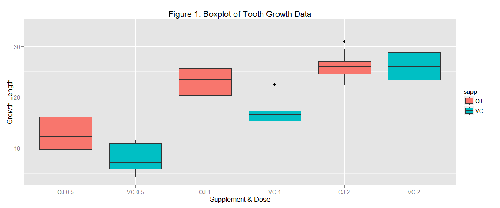

# Statistical Inference Project 2
August 14, 2015  


## Overview
In this project, the ToothGrowth data in the R datasets package will be analyzed. This data set shows the effect of vitamin C on tooth growth in guinea pigs at dose levels of 0.5, 1 and 2 mg. Two delivery methods were used : Orange juice and ascorbic acid (vitamin C).

## Exploratory Data Analysis

```r
# load in the data
library(datasets)
data(ToothGrowth)
```

Determine the type of data in the dataset by reviewing the structure and get some basic statistics data using the summary command.

```r
str(ToothGrowth)
```

```
## 'data.frame':	60 obs. of  3 variables:
##  $ len : num  4.2 11.5 7.3 5.8 6.4 10 11.2 11.2 5.2 7 ...
##  $ supp: Factor w/ 2 levels "OJ","VC": 2 2 2 2 2 2 2 2 2 2 ...
##  $ dose: num  0.5 0.5 0.5 0.5 0.5 0.5 0.5 0.5 0.5 0.5 ...
```

```r
summary(ToothGrowth)
```

```
##       len        supp         dose      
##  Min.   : 4.20   OJ:30   Min.   :0.500  
##  1st Qu.:13.07   VC:30   1st Qu.:0.500  
##  Median :19.25           Median :1.000  
##  Mean   :18.81           Mean   :1.167  
##  3rd Qu.:25.27           3rd Qu.:2.000  
##  Max.   :33.90           Max.   :2.000
```

The dataset contains 60 observations with growth length (_len_), delivery method (_supp_) and dosage (_dose_). 


```
##    len supp dose
## 1  4.2   VC  0.5
## 2 11.5   VC  0.5
## 3  7.3   VC  0.5
## 4  5.8   VC  0.5
## 5  6.4   VC  0.5
```

A boxplot is drawn to visualize the data (Figure 1)

 

From Figure 1, it appears that at doses of 0.5 and 1mg, the orange juice yields better tooth growth than the vitamin C. The plot also shows that at the higher dose of 2mg, the median tooth growth rates appear similar for both orange juice and vitamin C although the vitamin C has a higher variability. 


To see how close the growth rates are for 2mg dose, the mean and standard deviation for each supplement is calculated. The mean for orange juice is found to be **26.06** with a standard deviation of **2.66** and the mean tooth growth for vitamin C is **26.14** but has a larger standard deviation of **4.8**. See Appendix 2 for the R code that calculated these values.

## Hypothesis Testing

To test the hypotheses made below, the t.test function in R will be used. The confidence interval and the p value will then be used to determine whether the hypothesis is correct or not.

## Hypothesis 1 : Delivery Method Has an Affect On Tooth Growth
**Note**: The R code for the tests as well as the full t-test output can be found in the appendix 3.

**Null Hypothesis $H_{0}$** : The resulting tooth growth length does not depend on the delivery method.

**Alternative Hypothesis $H_{A}$** : The resulting tooth growth length is dependent on the delivery method. 

### T Test using all dose data.


This test yields a p-value of 0.0606 and a confidence interval of -0.1710156 to 7.5710156. Based on this p-value and the fact that the confidence interval contains zero so we cannot reject $H_{0}$ and therefor cannot accept $H_{A}$ that the resulting tooth growth length is dependent on the delivery method

However, it is worth while to investigate delivery method as a function of each of the 3 doses (0.5mg, 1mg and 2mg).

### T Tests for each dose level

**Dose= 0.5mg :** This test yields a p-value of  0.0064 and a confidence interval 1.7190573 to 8.7809427. Based on this this p-value and the fact that the confidence interval does not contain zero, we can reject $H_{0}$ in favor of $H_{A}$ when the dose is 0.5mg.


**Dose= 1.0mg :** This test yields a a p-value of 0.001 and a confidence interval of 2.8021482 to 9.0578518. Based on this this p-value and the fact that the confidence interval does not contain zero, we can reject $H_{0}$  in favor of $H_{A}$ when the dose is 1mg.


**Dose= 2.0mg :** This test yields a a p-value of 0.9639 and a confidence interval of -3.7980705 to 3.6380705. Based on   this p-value and the fact that the confidence interval does contain zero, we cannot reject $H_{0}$ and therefor cannot accept $H_{A}$ when the the dose is 2mg. The boxplots drawn earlier also support this finding.

## Hypothesis 2 : Dosage Amount Has an Affect On Tooth Growth
**Note**: The R code for the tests as well as the full t-test output can be found in the appendix 4.

**Null Hypothesis $H_{0}$** : The resulting tooth length growth does not depend on the dose delivered.

**Alternative Hypothesis $H_{A}$** : The resulting tooth length growth _is_ dependent on the dose delivered. 


The T-test comparing doses of **0.5mg and 1mg** yields a p-value of 0 and a confidence interval of -11.9837813 to -6.2762187


The T-test comparing doses of **0.5mg and 2mg** yields a p-value of 0 and a confidence interval of -18.1561665 to -12.8338335


The T-test comparing doses of **1mg and 2mg** yields a p-value of 0 and a confidence interval of -8.9964805 to -3.7335195

So, in all 3 tests, the confidence interval and p-values indicate that we can reject the null hypothesis $H_{0}$ in favor of the alternative hypothesis $H_{A}$ that the resulting tooth length growth _is_ dependent on the dose delivered.

## Assumptions
In the T-tests, we assume a 95% confidence (alpha=0.05). We will assume we can reject the null hypothesis when the p-value is < 0.05.

It is also assumed that the dataset contains data for 60 distinct guinea pigs that were given a single treatment and not 10 guinea pigs who were given all variations of treatments. Therefor, the dataset is assumed to be the result of independent samples and not paired samples.

The R t.test function uses a Welch Two Sample t-test. This test assumes a normal distribution. 

## Conclusion
From the tests it can be concluded that with respect to supplement delivery method, the evidence suggest that there is initially a difference in tooth growth for lower doses with orange juice producing better results. However, at the higher dose of 2mg, there is no significant difference in tooth growth.

Also, it can be concluded that for both supplement delivery methods, there is evidence that tooth growth is larger with increasing dosage levels.
\pagebreak

# Appendix

## Appendix 1 - Code for figure 1 (Boxplot of Tooth Growth Data)

```r
library(ggplot2)
plot <- ggplot(ToothGrowth, aes(x=interaction(supp, dose), y=len)) 
plot <- plot + geom_boxplot(aes(fill = supp)) 
plot <- plot + ggtitle("Figure 1: Boxplot of Tooth Growth Data")
plot <- plot + ylab("Growth Length") + xlab("Supplement & Dose")
```
## Appendix 2 - Code for calculating mean and standard deviation of tooth growth for 2mg dose.

```r
library(dplyr)
oj.2mg <- filter(ToothGrowth, supp == "OJ", dose == 2)
mean.oj <- mean(oj.2mg$len)
sd.oj <- sd(oj.2mg$len)
vc.2mg <- filter(ToothGrowth, supp == "VC", dose == 2)
mean.vc <- mean(vc.2mg$len)
sd.vc <- sd(vc.2mg$len)
```
## Appendix 3 - Code for hypothesis test 1 with  output


### T Test using all dose data.

```r
supp.test <- t.test(len ~ supp, data = ToothGrowth)  # Do T test.
supp.test
```

```
## 
## 	Welch Two Sample t-test
## 
## data:  len by supp
## t = 1.9153, df = 55.309, p-value = 0.06063
## alternative hypothesis: true difference in means is not equal to 0
## 95 percent confidence interval:
##  -0.1710156  7.5710156
## sample estimates:
## mean in group OJ mean in group VC 
##         20.66333         16.96333
```

### Dose specific T Tests
For each of the tests, the following code was used with the variable dose = 0.5, 1 and 2 for each of the three doses. Due to the limitations in report length, only the output for each test is shown.


```r
ToothGrowth.0.5mg <- filter(ToothGrowth, dose == 0.5)
supp.test <- t.test(len ~ supp, data = ToothGrowth.0.5mg)  # Do T test.
```

### T Test using data where dose = 0.5mg.

```
## 
## 	Welch Two Sample t-test
## 
## data:  len by supp
## t = 3.1697, df = 14.969, p-value = 0.006359
## alternative hypothesis: true difference in means is not equal to 0
## 95 percent confidence interval:
##  1.719057 8.780943
## sample estimates:
## mean in group OJ mean in group VC 
##            13.23             7.98
```
### T Test using data where dose = 1mg.

```
## 
## 	Welch Two Sample t-test
## 
## data:  len by supp
## t = 4.0328, df = 15.358, p-value = 0.001038
## alternative hypothesis: true difference in means is not equal to 0
## 95 percent confidence interval:
##  2.802148 9.057852
## sample estimates:
## mean in group OJ mean in group VC 
##            22.70            16.77
```
### T Test using data where dose = 2mg.

```
## 
## 	Welch Two Sample t-test
## 
## data:  len by supp
## t = -0.046136, df = 14.04, p-value = 0.9639
## alternative hypothesis: true difference in means is not equal to 0
## 95 percent confidence interval:
##  -3.79807  3.63807
## sample estimates:
## mean in group OJ mean in group VC 
##            26.06            26.14
```
## Appendix 4 - Code for hypothesis test 2 with output

For each of the tests, the following code was used with a vectors **c(0.5, 1.0)**, **c(0.5, 2.0)**, and **c(1.0, 2.0)** representing the 3 difference tests comparing 0.5mg with 1mg, 0.5mg with 2mg and 1mg with 2mg respectively. Due to the limitations in report length, only the output for each test is shown.

```r
doses <- filter(ToothGrowth, dose %in% c(0.5, 1.0))
dose.test <- t.test(len ~ dose, data = doses)
```

### T Test output using data comparing doses of 0.5mg and 1mg.


```
## 
## 	Welch Two Sample t-test
## 
## data:  len by dose
## t = -6.4766, df = 37.986, p-value = 1.268e-07
## alternative hypothesis: true difference in means is not equal to 0
## 95 percent confidence interval:
##  -11.983781  -6.276219
## sample estimates:
## mean in group 0.5   mean in group 1 
##            10.605            19.735
```
### T Test output using data comparing doses of 0.5mg and 2mg.

```
## 
## 	Welch Two Sample t-test
## 
## data:  len by dose
## t = -11.799, df = 36.883, p-value = 4.398e-14
## alternative hypothesis: true difference in means is not equal to 0
## 95 percent confidence interval:
##  -18.15617 -12.83383
## sample estimates:
## mean in group 0.5   mean in group 2 
##            10.605            26.100
```
### T Test output using data comparing doses of 1mg and 2mg.

```
## 
## 	Welch Two Sample t-test
## 
## data:  len by dose
## t = -4.9005, df = 37.101, p-value = 1.906e-05
## alternative hypothesis: true difference in means is not equal to 0
## 95 percent confidence interval:
##  -8.996481 -3.733519
## sample estimates:
## mean in group 1 mean in group 2 
##          19.735          26.100
```
