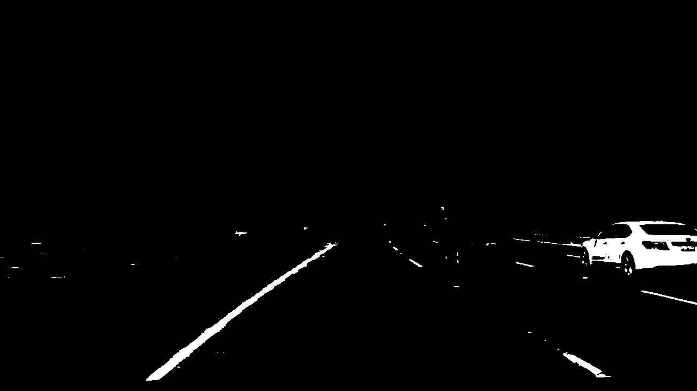
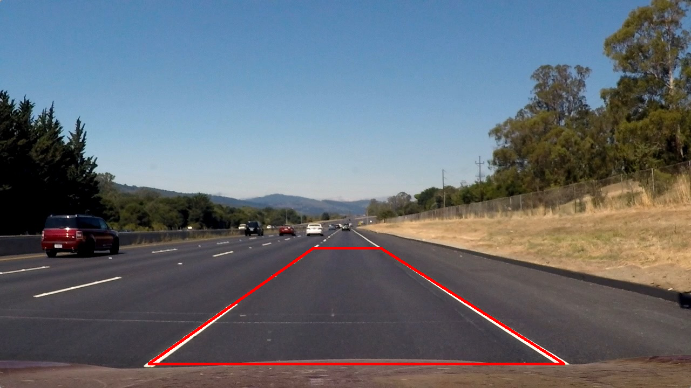
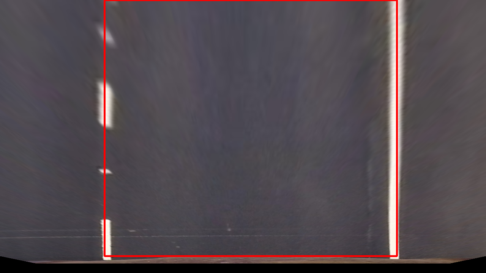
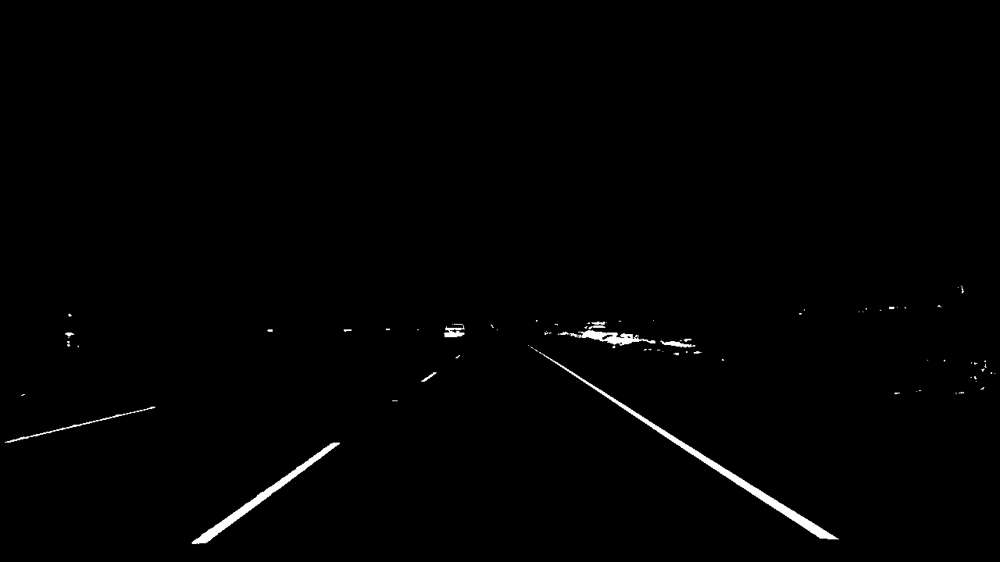
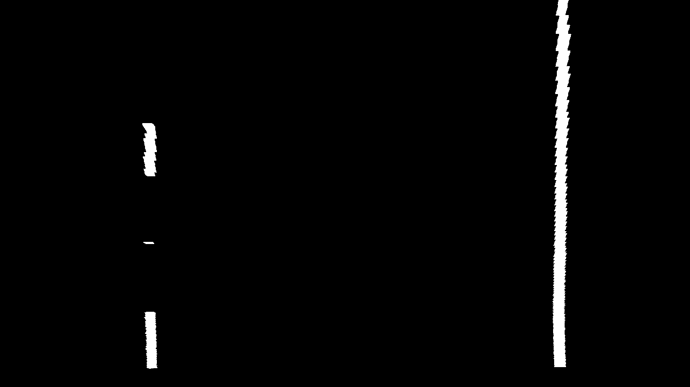
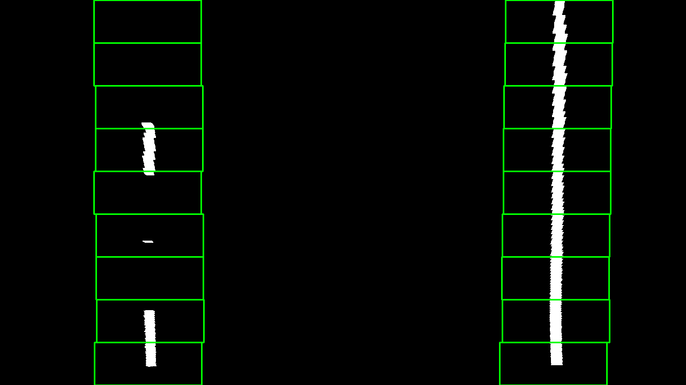
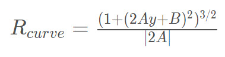
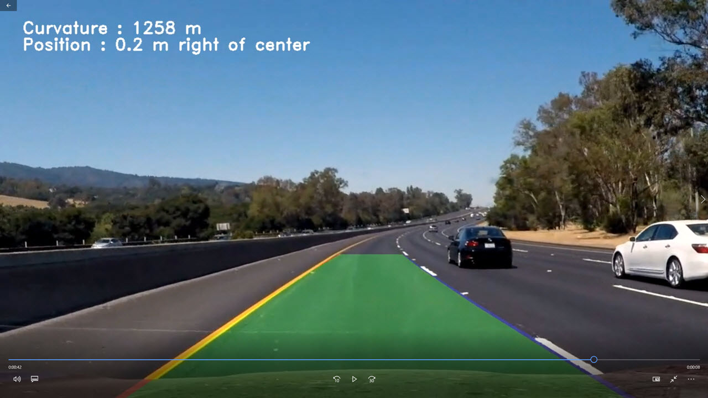

# Advanced Lane Finding Project

The goals / steps of this project are the following:

* Compute the camera calibration matrix and distortion coefficients given a set of chessboard images.
* Apply a distortion correction to raw images.
* Use color transforms, gradients, etc., to create a thresholded binary image.
* Apply a perspective transform to rectify binary image ("birds-eye view").
* Detect lane pixels and fit to find the lane boundary.
* Determine the curvature of the lane and vehicle position with respect to center.
* Warp the detected lane boundaries back onto the original image.
* Output visual display of the lane boundaries and numerical estimation of lane curvature and vehicle position.

---

## Project Files

The files for this project are located in this [Gitub repository](https://github.com/dvd940/Udacity_Self-Driving_Car/tree/master/Project4).

* Advanced Lane Finding jupyter notebook - this is the main script.

### Module Code Files

Most of the project code is located in the [project_modules](https://github.com/dvd940/Udacity_Self-Driving_Car/tree/master/Project4/project_modules) folder:

* calibrate_camera.py - Calibrating the camera
* image_process.py - undistorting, warping and obtaining binary images
* find_lanes.py - find the lane lines and curvature
* process_video.py - overlay found lines back onto the input video

### Output images

Output images from the steps in the pipeline are stored in the folder [output_images](https://github.com/dvd940/Udacity_Self-Driving_Car/tree/master/Project4/output_images)

The code for generating these images are in the Jupyter notebooks that follow the names convention test_script_*.ipynb (for example test_script_transform.ipynb).

## [Rubric](https://review.udacity.com/#!/rubrics/571/view) Points

### Here I will consider the rubric points individually and describe how I addressed each point in my implementation.  

---

### Writeup / README

#### 1. Provide a Writeup / README that includes all the rubric points and how you addressed each one.  You can submit your writeup as markdown or pdf. 

This document is the project write up. 

### Camera Calibration

#### 1. Briefly state how you computed the camera matrix and distortion coefficients. Provide an example of a distortion corrected calibration image.

The initial code for this step is contained in the file [calibrate_camera.py](https://github.com/dvd940/Udacity_Self-Driving_Car/blob/master/Project4/project_modules/calibrate_camera.py) starting on Line 14. 

The camera is calibrated using a series of checkerboard images which are fed into the cv2 package `findChessboardCorners()` function. This function attempts to find chessboard corners in the images. We use this data to map the coordinates of the 2D image to the 3D coordinates of an undistorted image. 

The output of the first step is fed into the `undistort_image()` function (Line 6) in [image_process.py](https://github.com/dvd940/Udacity_Self-Driving_Car/blob/master/Project4/project_modules/image_process.py) which utilizes the  CV2 `calibrateCamera()` and `undistort()`  functions to create an undistorted image. 

Here is an example of a distorted and undistorted image.

---

### Pipeline (single images)

#### 1. Provide an example of a distortion-corrected image.

As a demonstration of the calibration and undistort process, compare the following two images. The first one is a distorted image and the second is an image outputted from the `undistort_image()` image function.

#### 2. Describe how (and identify where in your code) you used color transforms, gradients or other methods to create a thresholded binary image.  Provide an example of a binary image result.

Initially, I used a combination of color and gradient thresholds to generate a binary image. However, later in the process I found that such images did not perform well when the image contained changing roads surfaces or if there were shadows in the frame. 

After much experimentation, I arrived at using a combination of thresholds using the R and G channels from an RGB image and the S and L channels from a HLS representation of the image. With this combination, the shadows and different road surfaces were not as problematic. 

Also, this method worked equally well with both yellow and white lines in most cases.

The code for this process can be found in the `color_threshold()` function (line 15) in [image_process.py](https://github.com/dvd940/Udacity_Self-Driving_Car/blob/master/Project4/project_modules/image_process.py) and an example of the output is shown here.

#### 3. Describe how (and identify where in your code) you performed a perspective transform and provide an example of a transformed image.

The next step in the pipeline is to conduct a perspective transform to yield a "bird eye view" image. The code for this can be found in the `perspective_transform()` function (line 52) in [image_process.py](https://github.com/dvd940/Udacity_Self-Driving_Car/blob/master/Project4/project_modules/image_process.py)

I initially took an image of a straight road (assumed to be flat) and manually determined points that contained the lane line. 

I then used these points to determining a mapping that would be used to create the top down view.

| Source        | Destination   | 
|:-------------:|:-------------:| 
| 275,675     | 275,675       | 
| 580,460      | 275,0      |
| 705,460     | 1045,0      |
| 1045,675      | 1045,675        |

Using the `getPerspectiveTransform()` function from CV2, the image was then warped to created the desired top down representation.

During the actual image processing, the input to this function was a binary image outputted from the color threshold step. An example output image can be seen below.

#### 4. Describe how (and identify where in your code) you identified lane-line pixels and fit their positions with a polynomial?

To identify the lane lines, a histogram of the pixels was taken along the bottom of the image. The window was then centered around the detected lines and the next set of line pixels were identified. By sliding this window along the detected line, the line pixels could be detected for the complete image. 

Using a second order polynomial fit, each set of line pixels was then used to identify the left and right lines. 

This method was implemented in the function `find_lanes()` (line 7) in the file [find_lanes.py](https://github.com/dvd940/Udacity_Self-Driving_Car/blob/master/Project4/project_modules/find_lanes.py)

An example of output is shown here:-

To help smooth out any outliers in the line fits, I implemented a very rudimentary smoothing filter where I actually use the fit which is the median  of the past 10 fits. 

**A Note About Finding the Next Set of Lines**

In the class it was advised that to speed up the process of lane finding, once a lane has been found, then when processing the next image frame, it is not necessary to conduct another blind search but instead just search in the vicinity of the previous line.

At this time, this method has not been implemented in this project. 

#### 5. Describe how (and identify where in your code) you calculated the radius of curvature of the lane and the position of the vehicle with respect to center.

The code to calculate the curvature of the road is located in the function `curvature_measurement()` (line 81) in the file [find_lanes.py](https://github.com/dvd940/Udacity_Self-Driving_Car/blob/master/Project4/project_modules/find_lanes.py).

This function takes the previously determine line fit and then calculates the curvature using the formula

This data is then overlayed onto the output video. 

In addition to this, the position of the vehicle in the lane is calculated in the same Python file using the function `vehicle_position()` (line 106).

#### 6. Provide an example image of your result plotted back down onto the road such that the lane area is identified clearly.

The code to output an overlay on the video image is done in the functions `draw_lane_image()` (line 14) and `output_curvature_data()` (line 38) in the file [process_video.py](https://github.com/dvd940/Udacity_Self-Driving_Car/blob/master/Project4/project_modules/process_video.py).

An example of an output frame is shown here. 

---

### Pipeline (video)

#### 1. Provide a link to your final video output.  Your pipeline should perform reasonably well on the entire project video (wobbly lines are ok but no catastrophic failures that would cause the car to drive off the road!).

**Link to video:** [Githib Link](https://github.com/dvd940/Udacity_Self-Driving_Car/blob/master/Project4/Advanced%20Lane%20Finding%20Output.mp4)

The video processing pipeline performs fairly well with some minor deviation from the lane lines. 

---

### Discussion

#### 1. Briefly discuss any problems / issues you faced in your implementation of this project.  Where will your pipeline likely fail?  What could you do to make it more robust?

#### Issues Encountered
Initially I used gradients to create binary images but no matter what thresholds I used, I was not able to have the application function well when the road surface changes from black to gray or when there was a shadow cast onto the roadway. In the end, I ditched the gradients and used only color spaces to generate the binary images. 

#### Potential improvements
It would be better implement the function to find the next line without doing an initial blind search as discussed in the class. Not having this feature did not impede my progress on this project since my PC is fairly pwerful but in a real world situation where an onboard controller would be used, such functionality would be more computationally efficient.

Different colorspaces (e.g. LAB, HSV) could be employed to improve lane detection in a variety of other lighting or road surface conditions. 

Some sanity testing could be employed whereby the distance between lines could be calculated and if it is not reasonable, then those lines could be thrown away. 

From a coding point of view, it would be better to organize the project into an object oriented one. This is something I will revisit in the future. 

