# Vehicle Detection Project

## Project Goal

The goal of this project is to create an image processing pipeline to detect vehicles in a video stream.

## Project Files

The files for this project are located in this [Gitub repository](https://github.com/dvd940/Udacity_Self-Driving_Car/tree/master/Project5).

#### Main Script Files

**Project 5 - Train Classifier.ipynb**  : Generate classifier model.

**Project 5 - Vehicle Detection and Tracking.ipynb** : Detect vehicles in a video.

#### Other Script Files

**Project 5 - Compare Parameters.ipynb** : Compare SVM accuracy for HOG features.

**Project 5 - Data Exploration.ipynb** : Explore train data images.

**Project 5 - Create Config.ipynb** : Create config file for file locations that can be shared amongst other scripts.

**Project 5 - Explore Image Classification.ipynb** : Explore classifier output.

#### Output images

Output images from the steps in the pipeline are stored in the folder [output_images](https://github.com/dvd940/Udacity_Self-Driving_Car/tree/master/Project5/output_images).

#### Output video

The output video is [Project 5 Output.mp4](https://github.com/dvd940/Udacity_Self-Driving_Car/blob/master/Project5/Project%205%20Output.mp4)

## [Rubric](https://review.udacity.com/#!/rubrics/513/view) Points

---

### Writeup / README

#### 1. Provide a Writeup / README that includes all the rubric points and how you addressed each one.  You can submit your writeup as markdown or pdf.  [Here](https://github.com/udacity/CarND-Vehicle-Detection/blob/master/writeup_template.md) is a template writeup for this project you can use as a guide and a starting point.  

This file is the README file.

### Histogram of Oriented Gradients (HOG)

To start, the dataset used was provided by Udacity and contained examples of car and non-car images. 

Examples of car images from the dataset
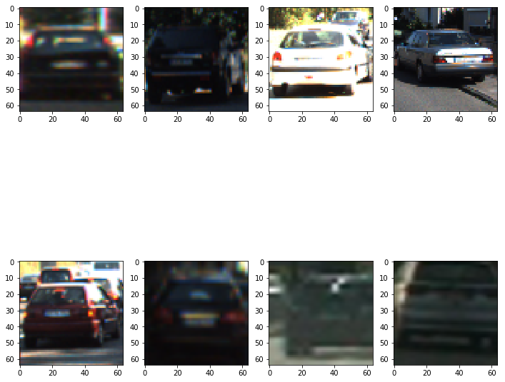

Examples of non-car images from the dataset
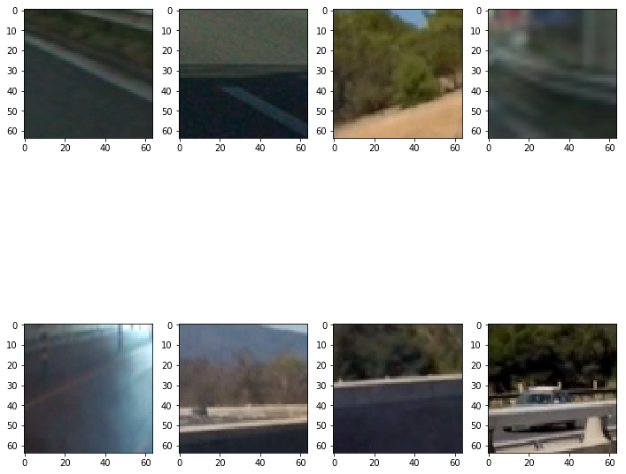

##### Color Space

Before extracting features for training the classifier, I determined which color space would be the most optimal to work in. To do this, I extracted features for each of the color spaces RGB, HSV, LUV, HLS, YUV, and YCrCb using arbitrary HOG parameter values and calculated accuracy of a Support Vector Machine (SVM) classifier. 

The accuracies can be seen in this box plot chart:-

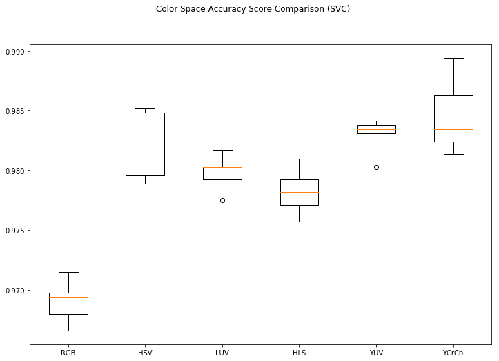

Based on this test, I chose the YCrCb color space for the rest of the project.

The code that generated this chart can be seen in the script **Project 5 - Compare Parameters.ipynb**

#### 1. Explain how (and identify where in your code) you extracted HOG features from the training images.

To extract HOG features from the training images, I used to hog function from the scikit-image library. This can be seen in **Project 5 - Train Classifier.ipynb** 

The final feature vector was created from spatial binning of each image combined with histogram of gradients (HOG) features.

Here are examples of HOG features for car and non-car images for each of 3 channels in the YCrCb color space.

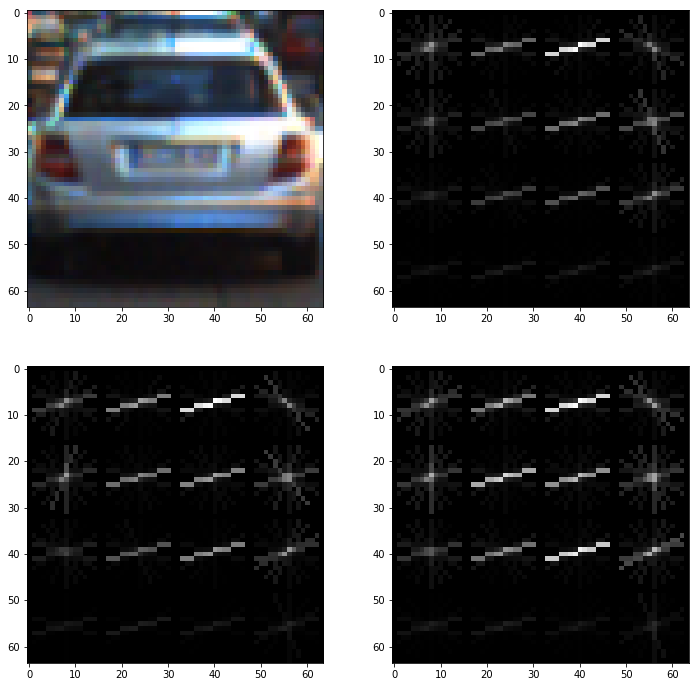
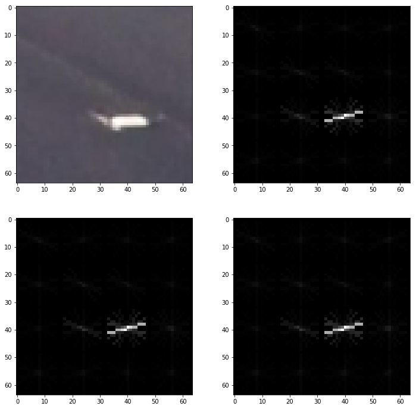

#### 2. Explain how you settled on your final choice of HOG parameters.

To determine the HOG parameter values, I ran an SVM classifier on the train data stepping through various parameter values and observed the results.

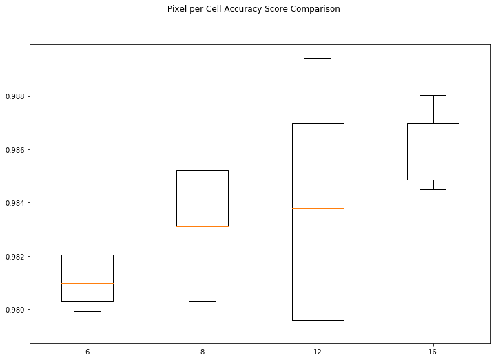

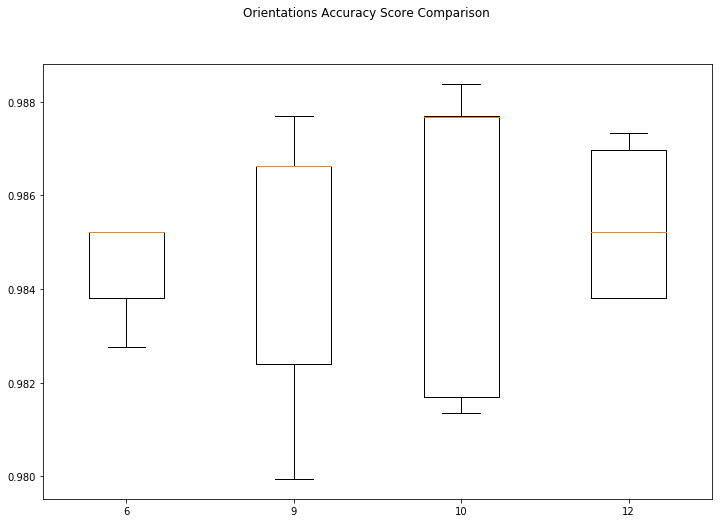

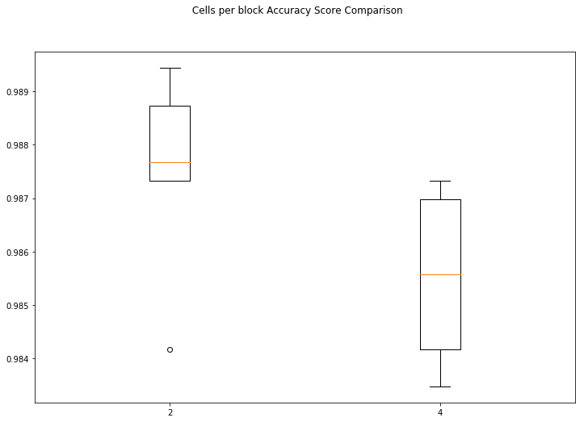

The code for each of these charts can be seen in the script **Project 5 - Compare Parameters.ipynb**

For the final classifier, I chose the following parameters:-

| Parameter        | Value   | 
|:-------------:|:-------------:| 
| pix_per_cell     | 16       | 
| cell_per_block       | 2      |
| orient      | 9      |

 The values were decided based on accuracy along with consideration for compute time. 

#### 3. Describe how (and identify where in your code) you trained a classifier using your selected HOG features (and color features if you used them).

To train the classifier, I first created an array of all labeled car and non car feature vectors. Since the color data and HOG features could be in different scales, I scaled this data using the Scikit Learn `StandardScaler()` function (cell 10 in **Project 5 - Train Classifier.ipynb**). 

I then randomly split the data into train and test sets.

The classifier chosen was a linear Support Vector Machine based on advice provided in the class. (cell 11 in **Project 5 - Train Classifier.ipynb**)

This classifier produced an accuracy of 0.989 on the test set.

### Sliding Window Search

#### 1. Describe how (and identify where in your code) you implemented a sliding window search.  How did you decide what scales to search and how much to overlap windows?

I used a sliding window technique similar to that presented in the class. See the function `find_cars()` in cell 5 of **Project 5 - Vehicle Detection and Tracking.ipynb**.

In the final project, I used a window of scale 1 for y values between 400 and 500, and a scale of 1.5 for y values between 400 and 550. These parameters were chosen based on trial and error. 

The parameter cells_per_step was left at 2 (per the class implementation) which yields an overlap of 75%.

See cell 12 of **Project 5 - Vehicle Detection and Tracking.ipynb** for where each of these scales is chosen and passed to the `find_cars()` function.

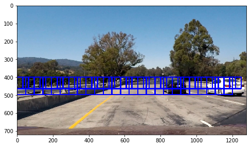

#### 2. Show some examples of test images to demonstrate how your pipeline is working.  What did you do to optimize the performance of your classifier?

Here are some examples of the output from the image classifier pipeline.

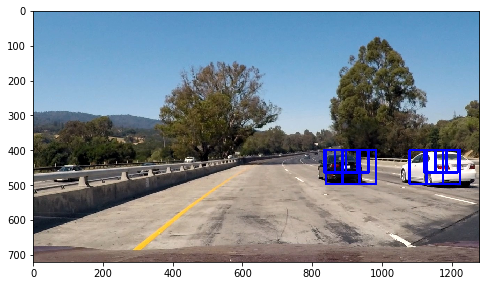

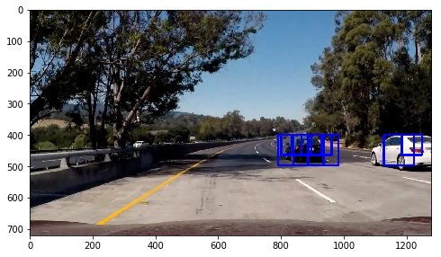

In order to optimize the performance of the classifier, heat maps were created of the overlapping windows. Shown here are the heat map images of the two images above.

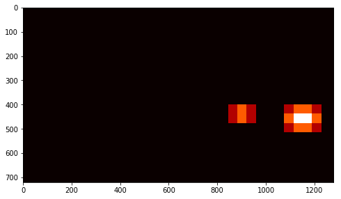

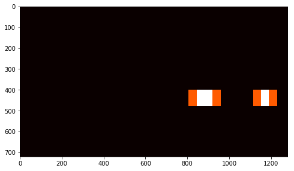

Then, using the `label()` function from scipy, the heat maps could be attributed to specific detected cars. A box was then drawn around those detected cars. 

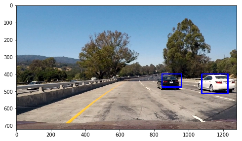

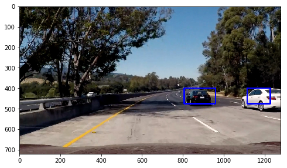

The code for this part of the pipeline is in the `image_process()` function in cell 12 of **Project 5 - Vehicle Detection and Tracking.ipynb**

---

### Video Implementation

#### 1. Provide a link to your final video output.  Your pipeline should perform reasonably well on the entire project video (somewhat wobbly or unstable bounding boxes are ok as long as you are identifying the vehicles most of the time with minimal false positives.)

The output video is [Project 5 Output.mp4](https://github.com/dvd940/Udacity_Self-Driving_Car/blob/master/Project5/Project%205%20Output.mp4)

#### 2. Describe how (and identify where in your code) you implemented some kind of filter for false positives and some method for combining overlapping bounding boxes.

To reduce false positives I implemented a number of techniques.

First, I smoothed out the generated heat maps by calculating the median over *n* frames in `smooth_heatmaps()` (cell 11 in Project 5 - Vehicle Detection and Tracking.ipynb) and then passed the output to the labels function in `image_process()` (cell 12 in Project 5 - Vehicle Detection and Tracking.ipynb). The previous *n* heat maps were saved in a class `HeatMaps` (cell 11 in Project 5 - Vehicle Detection and Tracking.ipynb) 

Then, to avoid detections on the left side of the road over the barrier, I also limited the area of the image to search in the `find_cars()` to the right side of the image (cell 5 in Project 5 - Vehicle Detection and Tracking.ipynb) 

**Note:** Despite these techniques, there are a few, albeit minimal, false positives still visible in the output video.

---

### Discussion

#### 1. Briefly discuss any problems / issues you faced in your implementation of this project.  Where will your pipeline likely fail?  What could you do to make it more robust?

Initially, I experimented with some other color spaces but found that, depending of the color space, the classifier could not always detect either the white or black car. After checking the accuracy of each of the color spaces, I decided to use YCrCb.

The image process pipeline used in the final project still exhibits a small number of false positives. These may be eliminated by fine tuning the heat map threshold and perhaps by increasing the number of orientations in the hog function further. However, I suspect that this would increase the computation time. 

To eliminate false positives on the other side of the road, I limited the area of the image to search to ignore that part of the image. However, this is not a very robust method in the long term since if the test car was in the center lane, then nearby cars in the left lane would not be detected. 

To improve the accuracy of the classifier, a larger training set could be used. Also, the inclusion of other vehicles such as trucks or motorcycles would improve the robustness of the vehicle detection.

I did not explore other classifier methods. It is possible that using a neural network or ensembles would yield more satisfactory results. 

Lastly, the classification is not real time. The video is processed at around 7 frames per second on an Intel 7700K Core i7 processor with 32 GB RAM. In the real world, this would be too slow to detect cars on the road.

