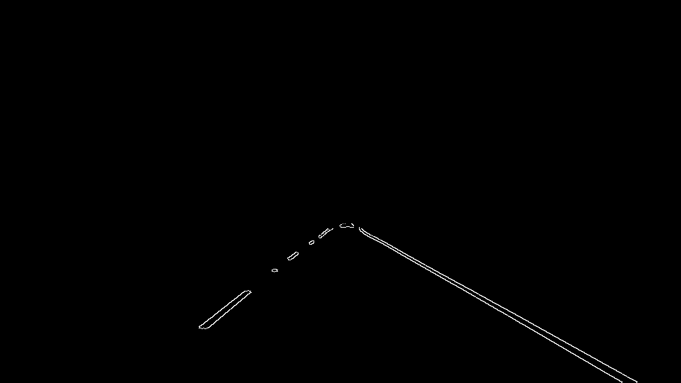
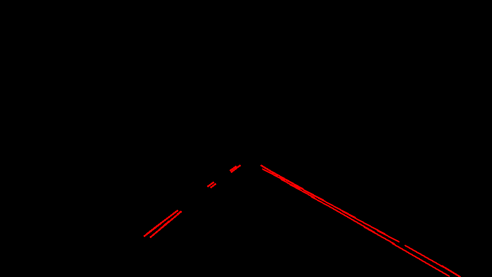
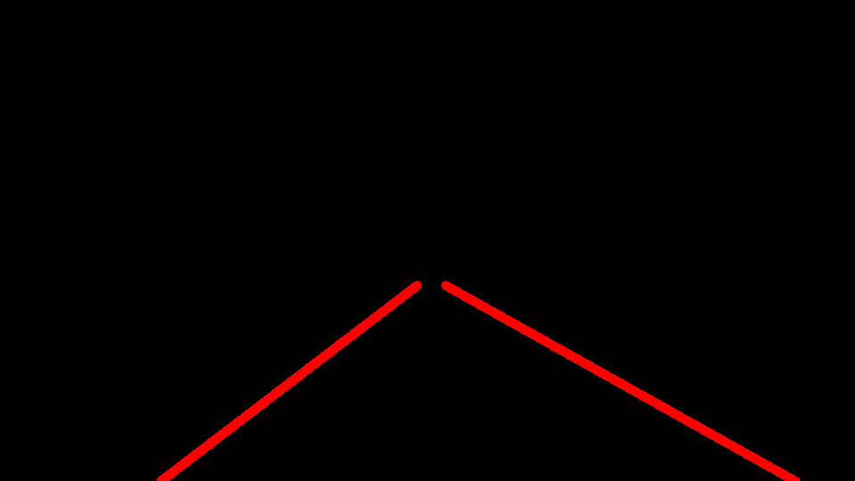
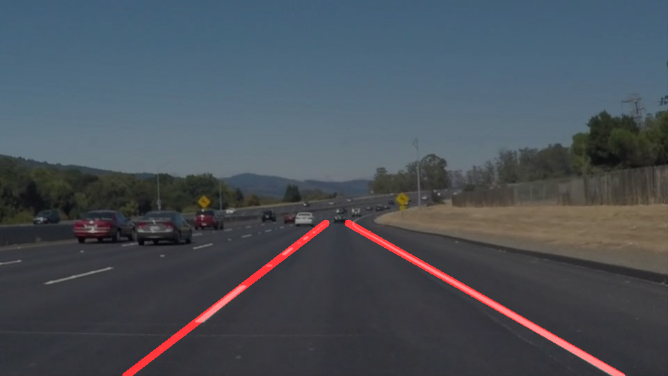

# Project Goals

The goal of this project is to create an image processing pipeline that can take an image of a road and detect where the lane lines are on that image. 

Here is an example of an input image:-

# Reflection

## 1. Pipeline description. 

The image processing pipeline consists of 7 steps.

Step 1. Convert image to gray scale

Step 2. Apply Gaussian smoothing to mitigate artifacts due to noise in the image.

Step 3. Detect edges in the image using the **Canny Edge Detection** algorithm.

Step 4. Create a mask around a region of interest to limit the processing to where the lane lines are expected to be.

Step 5. Detect lines using the **Hough Transform** algorithm.

Step 6. Create full lines by interpolating the output from the Hough Transform step.

To do this, the `draw_lines()` function was modified to determine each side of the lane by calculating the slope of the lines. A positive slope indicates 
the left lane line and a negative slope indicates the right lane line.

A least squares fit is then calculated  to create a single best fit line for each of the right and left lines.

Step 7. Overlay the line image on the original image.

## 2. Potential shortcomings with this pipeline

One obvious shortcoming is that the current pipeline does not deal with curved lines very well.

Also, the interpolated line has some jitter which means the interpolation is not as exact as it could be. 

## 3. Possible improvements to the pipeline

It may be possible to deal with curved lines by using a polynomial fit instead of a linear fit to the detected lines. However, I have 
not yet tested this theory. 

Secondly, it is possible that the lines detected by the Hough Transform step may contain spurious values. By filtering out potential outlier values, 
it may be possible to reduce some of the jitter observed when using the current pipeline.

