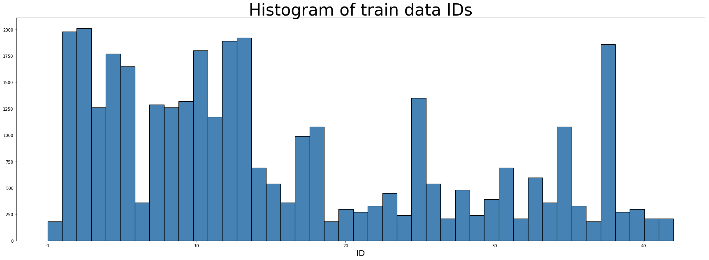
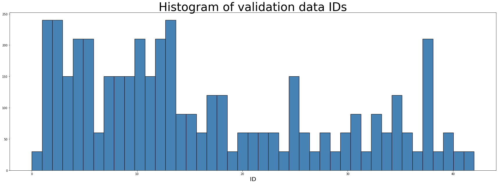
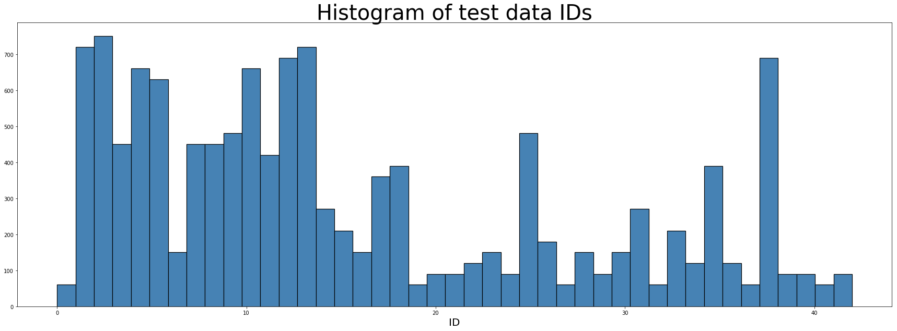
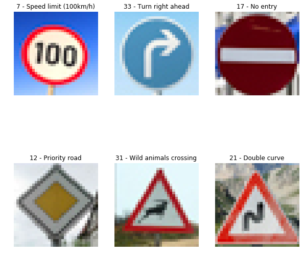
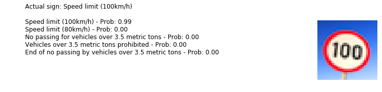
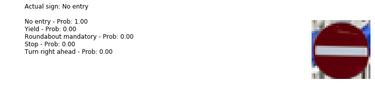
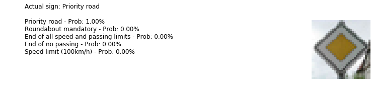
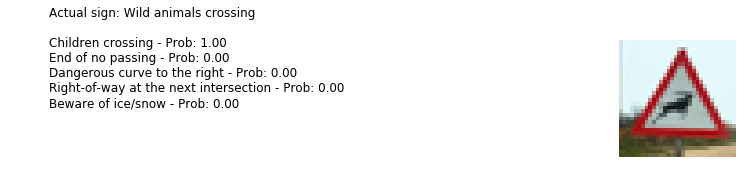
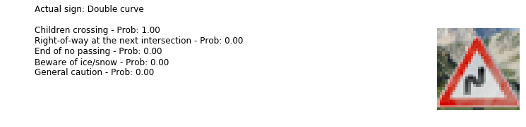

# Traffic Sign Classifier Project

## Project Objective

The objective of this project was to build a neural network classifier that can recognize traffic signs. 

## Rubric points 

In this writeup,  I will address each of the rubric points. For the code used in this project, please review the Jupyter Notebook located on [Github](https://github.com/dvd940/Udacity_Self-Driving_Car/blob/master/Project2/Traffic_Sign_Classifier.ipynb)

## Dataset Exploration

### Data Exploration - Basic Summary

The dataset used for training this neural network was the [German Traffic Sign Dataset](http://benchmark.ini.rub.de/?section=gtsrb&subsection=dataset).

* The number of training examples in the dataset is 34799 samples

* The number of testing examples in the dataset is 12630

* The shape of the images is 32 x 32 x 3

* The number of classes is 43

### Visualization

Here is an example of some of the images in the dataset.

Following is a histogram of the class labels. It is interesting that not every sign is represented with the same frequency in the training set. This may have an impact on the ability to classify some signs. 

## Design and Test a Model Architecture

### Preprocessing

Prior to training, the images were converted to grayscale. This should improve training time since the 3 color channels can add to the complexity of the calculations. Also, experiments by [Pierre Sermanet and Yann LeCun](http://yann.lecun.com/exdb/publis/pdf/sermanet-ijcnn-11.pdf) indicate that using grayscale images can improve accuracy. 

The images were normalized (mean zero and equal variance) to improve numerical stability which helps the network optimize in a more efficient manner.

The train data was then shuffled in case that the data was in some predetermined order.

### Model Architecture

The model architecture used was based on the LeNet-5 architecture developed by Yann LeCun. 

Changes to the standard LeNet-5 architecture includes adding dropout after each of the first two fully connected layers with the aim of reducing overfitting.

| Layer | Type | Activation | Input| Output |
|:---:|:---:|:---:|:---:|:---:|
| Conv1 | 2 D Convolutional | ReLU | 32 x 32 x 1 | 28 x 28 x 6 |
| MaxPool1 | Max pool layer | N/A | 28 x 28 x 6 | 14 x 14 x 6 |
| Conv2 | 2 D Convolutional | ReLU |14 x 14 x 6 | 10 x 10 x 16 |
| MaxPool2 | Max pool layer | N/A | 10 x 10 x 16|5 x 5 x 16 |
|Flatten|Flatten layer|N/A| 5 x 5 x 16|400|
|FC1|Fully connected layer 1 with drop out|ReLU|400|120|
|FC2|Fully connected layer 2 with drop out|ReLU|120|84|
|FC3|Fully connected layer 3 (logits)|N/A| 84 |10|

### Model Training

The model was trained using the Adam Optimizer.

A batch size was chosen to be 256.

It was found that the accuracy on the validation set achieved greater than 0.94 after around 30 epochs. 50 epochs were chosen in the final model balancing accuracy and training time.

A learning rate of 0.001 was used.

### Solution Approach

During training, the accuracy was evaluated for each epoch using a validation set. After 50 epochs, the validation set accuracy was **0.954**.

The final model was then tested on a hold out test set. The accuracy on this unseen test set was **0.933**.

## Testing the Model on New Images

### Acquiring New Images

6 images were downloaded from the web found using a google image search for "german road signs". Care was taken to not use images that had watermarks to avoid potential noise that the neural network had not seen before.

The dimensions of each images were converted to 32 x 32 in Adobe Lightroom to match the images used during training.

Some of these images, for example "No entry" and "Turn right ahead", are quite distinctive and it would be expected that these may be classified correctly. 

However, images like the "Wild animals crossing" and "Double curve" are not as distinctive, especially at low resolution. There are many signs which take the form of a white triangle with a red border and a graphic in the center. So it would be possible that these image could be mis-categorized. 

Also, the frequecy count for "Double curve" was quite low at only 270.

### Performance on New Images

Predictions were made on the downloaded images and the network correctly predicted 4 out of the 6 images. That is an accurracy of 0.667.

Predicted: Speed limit (100km/h), Actual: Speed limit (100km/h)

Predicted: Turn right ahead, Actual: Turn right ahead

Predicted: No entry, Actual: No entry

Predicted: Priority road, Actual: Priority road

Predicted: Children crossing, Actual: Wild animals crossing

Predicted: Children crossing, Actual: Double curve

### Model Certainty - Softmax Probabilities

Looking at the softmax output for each of the predictions, it can bee seen that "Speed limit (100km/h)", "Turn right ahead", "No entry" and "Priority road" were all predicted with 100% certainty. 

#### Correct predictions

#### Incorrect predictions

However, this was not the case for "Wild animals crossing" and "Double curve" where both were predicted to be "Children crossing".

It can be seen using an image from [Wikipedia](https://en.wikipedia.org/wiki/Road_signs_in_Germany) that the "Children crossing" sign does bare some resemblance to both mis-categorized signs.

